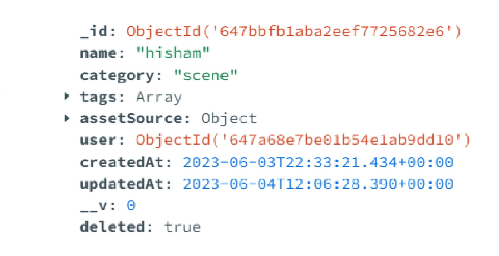

# Asset Management System

### Description

- Sign Up for a user
- Sign In for a user
- CRUD operations on an Asset
- Dashboard to see uploaded pictures

## API Reference

#### URL = https://asset-management-0au6.onrender.com

#### Create User

```http
  POST /api/v1/users/create
```

| Body (application/json) | Type     | Description   |
| :---------------------- | :------- | :------------ |
| `name`                  | `string` | **Required**. |
| `email`                 | `string` | **Required**. |
| `password`              | `string` | **Required**. |

#### Login

```http
  POST /api/v1/auth/login
```

| Parameter  | Type     | Description   |
| :--------- | :------- | :------------ |
| `email`    | `string` | **Required**. |
| `password` | `string` | **Required**. |

#### create an asset

```http
  POST /api/v1/asset/create/:userId
```

| Body (multipart/form-data) | params   | Type       | Description   |
| :------------------------- | :------- | :--------- | :------------ |
| `-`                        | `userId` | `ObjectId` | **Required**. |
| `name`                     | `-`      | `string`   | **Required**. |
| `category`                 | `-`      | `string`   | **Required**. |
| `tags`                     | `-`      | `string`   | **Required**. |
| `folder`                   | `-`      | `file`     | **Required**. |

#### Get an asset by asset Id

```http
  GET /api/v1/asset/:assetId
```

| Parameter | Type       | Description   |
| :-------- | :--------- | :------------ |
| `assetId` | `ObjectId` | **Required**. |

#### Get Assets By User Id

```http
  GET /api/v1/asset/user/:userId
```

| Parameter | Type       | Description   |
| :-------- | :--------- | :------------ |
| `userId`  | `ObjectId` | **Required**. |

#### Update an asset by asset Id

```http
  PUT /api/v1/asset/update/:assetId
```

| Body (application/json) | params    | Type       | Description   |
| :---------------------- | :-------- | :--------- | :------------ |
| `-`                     | `assetId` | `ObjectId` | **Required**. |
| `name`                  | `-`       | `string`   | **Required**. |
| `category`              | `-`       | `string`   | **Required**. |
| `tags`                  | `-`       | `array`    | **Required**. |

#### Delete an asset by asset Id

```http
  DELETE /api/v1/asset/update/:assetId
```

| Parameter | Type       | Description   |
| :-------- | :--------- | :------------ |
| `assetId` | `ObjectId` | **Required**. |

## UI Demo

https://asset-management-0au6.onrender.com/dashboard

## Environment Variables

To run this project locally, you will need to add the following environment variables to your .env file created in root directory of your project

- JWT_SECRET
- MONGO_DEV_URL
- AWS_ACCESS_ID
- AWS_SECRET_ACCESS_KEY
- AWS_S3_REGION
- AWS_S3_BUCKET_NAME

#### Note: Also, you will need to update proxy in vite.config() by localhost:${port_number}

## Screenshots

### Mongo DB record for an asset


### Mongo DB record for an asset soft delete



### Mongo DB record for an asset soft delete


